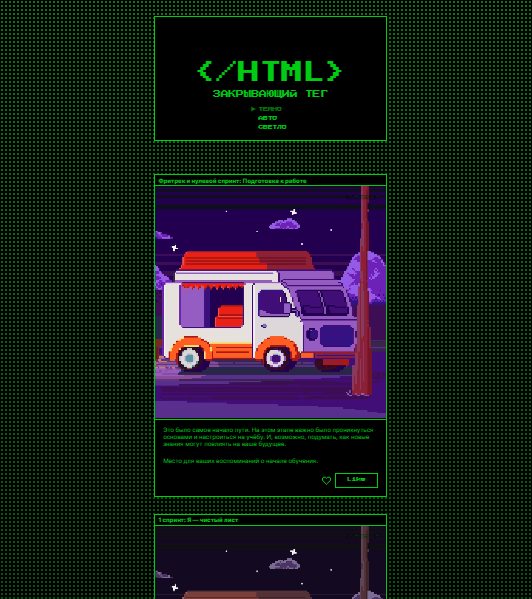

https://github.com/Murka69/zakrivayuschiy-teg-f.git

# 💻 Проект «Закрывающий тег»

## Описание

Проект **«Закрывающий тег»** — это доступный и интерактивный веб-сайт с анимациями, реализованными на чистом CSS. В процессе разработки я уделяла особое внимание **удобству использования**, **доступности** и **визуальной привлекательности**.

Сайт поддерживает **темную и светлую темы оформления**, имеет множество интерактивных элементов и плавные анимации, которые улучшают пользовательский опыт.

---

## 💡 Использованные технологии

- **HTML5** – семантическая разметка, доступность (ARIA)
- **CSS3** – стили, медиазапросы (`@media`), ключевые кадры анимации (`@keyframes`), Flexbox, SVG, переменные CSS
- _(Опционально)_ **JavaScript** – если использовался для логики переключения тем или состояния лайков

---

## 🎨 Анимации

Анимации добавляют проекту динамики и делают его более живым и отзывчивым:

- **Стрелка у активного пункта меню**  
  Постоянно двигается вправо-влево, акцентируя внимание на текущем разделе.

- **Плавное подчёркивание при фокусе через Tab**  
  При переходе по кнопкам меню клавишей `Tab` происходит плавная анимация подчёркивания слева направо.

- **Кнопка "Лайк"**
  - При наведении мыши: плавное перекрытие контрастным цветом и изменение цвета текста.
  - При клике: сердце увеличивается в размерах и выбрасывает анимированные искры.
  - При наведении на сердце: меняется цвет.

---

## ⚙️ Функционал

- **Переключение тем оформления**  
  При нажатии на кнопку меню можно выбрать светлую или тёмную тему. Если тема не задана, используется системная настройка пользователя.

- **Работа с лайками**

  - Лайк отмечает карточку:
    - Если лайка ещё не было — сердце закрашивается.
    - Если лайк уже был — сердце становится контурным.
  - Состояние сохраняется в JavaScript (без бэкенда).

- **Модальное окно при сохранении**  
  При нажатии на кнопку "Сохранить" открывается модальное окно с подтверждением действия.

---

🖼️[Макет в Figma](https://www.figma.com/design/laZw5Pca6OACuk75OUNauY/-8-%3C-закрывающий-тег%3E--Copy-?node-id=0-1&p=f&t=mkwIw2VT6Wsf0Rur-0)

---

## 🛠 Как запустить локально

1. Склонируйте репозиторий:
   ```bash
   git clone https://github.com/ ваше-имя/zakr-taeg.git
   ```
2. Перейдите в папку проекта:
   ```bash
   cd zakr-taeg
   ```
3. Откройте файл `index.html` в браузере — сайт готов к просмотру!

## Предварительный просмотр

